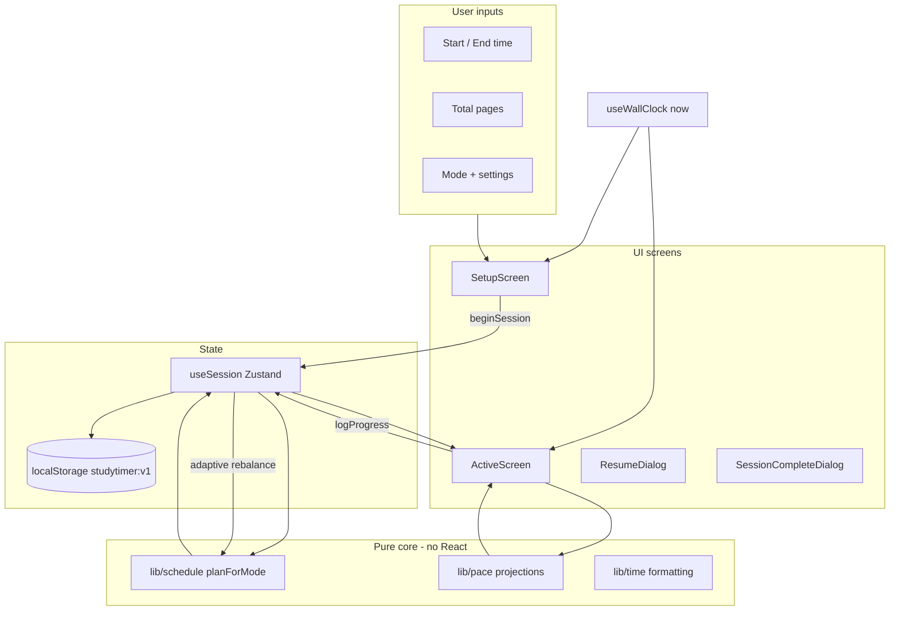

# StudyPace — Fable 5 Project Orchestration

> **Living document.** Fable 5 owns this file. Update it at the end of every work cycle (see [Continuous update protocol](#continuous-update-protocol)).

| Field | Value |
|-------|-------|
| **Last updated** | 2026-06-10 |
| **Updated by** | Fable 5 — Cycle 1 |
| **Phase** | `EXECUTE` |
| **Overall progress** | ~62% feature-complete (P0 fixes + Vitest/schedule tests; CI/UX/browser QA remain) |
| **Active sprint** | P1 UX polish + CI |
| **Dev server** | `http://localhost:5173` |
| **Repo** | `C:\Users\sardo\OneDrive\Documents\GitHub\Study_Timer` |

---

## How to use this file (human)

1. Open a **new long-running Cursor agent** with model **`claude-fable-5-thinking-high`** (Fable 5).
2. Paste the [Kickoff prompt](#kickoff-prompt-copy-paste-for-fable-5) below (or say: *"Read and execute `FABLE5_PROJECT.md` autonomously"*).
3. Let it run. It will plan, delegate coding to Composer 2.5 subagents, test in Chrome, review, and update this file after each cycle.
4. Re-open this file anytime to see goals, backlog, and session log.

---

## Kickoff prompt (copy-paste for Fable 5)

```text
You are the autonomous project manager and tech lead for StudyPace (Study Timer).

Read FABLE5_PROJECT.md in the repo root completely, then execute it.

Operating rules:
1. Act as PM first: audit → prioritize → plan sprints → delegate → review → test → merge-quality output.
2. Delegate ALL implementation to Composer 2.5 subagents (subagent_type: "generalPurpose", model: "composer-2.5-fast"). One focused task per subagent. Never batch unrelated work.
3. After each subagent returns: review the diff, run `npm run lint` and `npm run build`, test in the browser (agent-browser + browser-screenshot skill), fix or re-delegate if needed.
4. Update FABLE5_PROJECT.md before ending every turn (Completed, Next steps, Session log, Progress %).
5. Work through the entire backlog without waiting for user input unless truly blocked.
6. Use /loop or self-paced heartbeat wakes to keep running until backlog is empty or you hit a hard blocker.
7. Do not commit unless the user asks; stage logical chunks and note them in the session log.

Start now: re-audit the codebase, reconcile this doc with reality, pick the highest-priority backlog item, and begin the first sprint.
```

---

## Project summary

**StudyPace** is a wall-clock-accurate study timer. The user sets:

- Current / start time
- Target finish time
- Pages or sections to cover
- Scheduling mode (Even, Pomodoro, Adaptive)

The app breaks the session into paced sections, tracks progress against targets, adapts estimates (especially in Adaptive mode), and survives refresh/tab close because all display state is derived from `Date.now()`, not a decrementing counter.

**North star:** A student can plan a session in under 60 seconds, run it for hours without the timer lying, log progress with minimal friction, and always know if they are ahead or behind — on desktop and mobile, light and dark, with or without network.

---

## Goals

### P0 — Must ship (correctness & trust)

- [x] No theme/prefs persistence bugs (single source of truth) — **2026-06-10**
- [ ] Wall-clock accuracy holds across refresh, background tab, and resume
- [ ] All three scheduling modes produce correct section plans and page targets
- [x] Adaptive rebalance fires when section closes without user logging — **2026-06-10**
- [ ] Progress logging, ETC, and target finish are consistent everywhere (hero, timeline, footer)
- [ ] `npm run lint` and `npm run build` pass cleanly — **passing 2026-06-10**

### P1 — Strong product (UX & completeness)

- [ ] Full keyboard shortcut discoverability (+/−, Shift variants, L for log)
- [ ] Setup validation UX (clear errors, sensible defaults, edge cases like overnight sessions)
- [ ] Session complete screen with meaningful recap (pace chart, on-time vs late, export)
- [ ] Mid-session controls: extend deadline, pause is NOT desired (wall-clock honesty) but *adjust plan* may be
- [ ] Mobile layout pass (touch targets, timeline scroll, popup usability)
- [ ] Accessibility pass (focus order, aria-live, contrast, reduced motion)
- [ ] Consistent StudyPace branding (package name, titles, OG meta)

### P2 — Quality & maintainability

- [ ] Unit tests for pure libs (`lib/time.ts`, `lib/pace.ts`, `lib/schedule/*`) — **29 tests, 2026-06-10**
- [ ] Component tests for critical UI (setup validation, progress popup)
- [ ] GitHub Actions CI (lint + build + test on PR)
- [ ] Error boundary + graceful degradation
- [ ] LICENSE file (README says MIT)

### P3 — Nice-to-have / growth

- [ ] PWA (installable, offline shell)
- [ ] Session history / stats over time
- [ ] Presets & templates (subject, pages, typical duration)
- [ ] Import/export settings JSON
- [ ] Richer notifications (section name, pages behind)
- [ ] Sound choice / volume for chime
- [ ] Deploy config (Vercel/Netlify) + preview URL in README

---

## Completed steps

> Fable 5: append dated entries here as work lands. Do not delete — strike through or move to "Shipped" with date.

### Shipped (baseline — pre-orchestration audit)

- [x] **Core stack** — React 18, Vite 5, TypeScript, Tailwind, Zustand, Framer Motion, date-fns
- [x] **Three modes** — Even Breakdown, Pomodoro, Adaptive Flow (`src/lib/schedule/`)
- [x] **Wall-clock engine** — `useWallClock` 250 ms tick; all state derived from `now` (`src/hooks/useWallClock.ts`)
- [x] **Setup flow** — subject, times, pages, mode tabs, settings panel, plan preview (`src/components/setup/`)
- [x] **Active session** — hero, dual-fill progress bar, timeline cards, ETC footer (`src/components/active/`)
- [x] **Progress popup** — section-boundary logging, keyboard shortcuts (`ProgressPopup.tsx`, `ActiveScreen.tsx`)
- [x] **Adaptive rebalance** — smoothed pace, flow/recovery, adjustment badges (`src/lib/schedule/adaptive.ts`)
- [x] **Persistence** — Zustand persist + resume dialog (`src/store/useSession.ts`, `ResumeDialog.tsx`)
- [x] **Prefs** — chime, notifications, theme toggle (`PrefsMenu.tsx`, `ActiveScreen.tsx`)
- [x] **Polish** — wake lock, tab title, notifications when hidden, reduced-motion CSS, responsive layout
- [x] **Session complete dialog** — basic stats recap (`SessionCompleteDialog.tsx`)
- [x] **README** — architecture and feature documentation

### Shipped (orchestration cycles)

- [x] **2026-06-10 — B1 theme single source of truth** — `src/lib/theme.ts`; FOUC reads `studytimer:v1` prefs; `ThemeToggle` uses `setPrefs`; legacy `studytimer:theme` migrated + cleared; `theme-color` meta syncs on toggle
- [x] **2026-06-10 — Vitest + schedule/time/pace tests** — 29 tests across `time`, `pace`, `even`, `pomodoro`, `adaptive`; `npm test` script added

---

## Next steps

> Fable 5: keep this ordered top-to-bottom by priority. Mark the current item with `→ IN PROGRESS`.

| # | Priority | Task | Owner | Status |
|---|----------|------|-------|--------|
| 1 | P0 | Reconcile theme persistence (`studytimer:theme` vs `prefs.theme` in Zustand) — single source of truth, no FOUC | Fable 5 | `done` 2026-06-10 |
| 2 | P0 | Verify adaptive rebalance triggers when section closes *without* user logging (advance path) | Fable 5 | `done` 2026-06-10 |
| 3 | P0 | Audit `lib/schedule/*` math with unit tests (even clamp, pomodoro cycles, adaptive rebalance) | Fable 5 | `done` 2026-06-10 |
| 4 | P1 | Add Vitest + test script; cover `time.ts`, `pace.ts`, schedulers | Fable 5 | `done` 2026-06-10 |
| 5 | P1 | Browser QA pass: setup → active → log → complete → resume (screenshot each screen) | Fable 5 | `blocked` — Chrome remote debugging not running |
| 6 | P1 | Mobile viewport pass (375×812, 390×844) — fix layout/overflow issues | Fable 5 → Composer | `→ IN PROGRESS` |
| 7 | P1 | Keyboard shortcuts help panel (? key or footer link) | Fable 5 → Composer | `pending` |
| 8 | P1 | Enrich session complete (on-time delta, pace sparkline or section table) | Fable 5 → Composer | `pending` |
| 9 | P2 | GitHub Actions CI workflow | Fable 5 → Composer | `pending` |
| 10 | P2 | Error boundary around `App` | Fable 5 → Composer | `pending` |
| 11 | P2 | Add `LICENSE` (MIT) | Fable 5 → Composer | `pending` |
| 12 | P3 | PWA manifest + service worker (vite-plugin-pwa) | Fable 5 → Composer | `pending` |
| 13 | P3 | Session history in localStorage (read-only past sessions list) | Fable 5 → Composer | `pending` |

---

## Audit backlog (full)

> Discovered 2026-06-10. Fable 5 should validate each item, add findings, and check off or re-prioritize.

### Bugs & correctness

| ID | Finding | Severity | Files |
|----|---------|----------|-------|
| B1 | Theme stored in two places: `localStorage studytimer:theme` (`main.tsx`, `ActiveScreen.tsx`) AND `prefs.theme` in Zustand — can desync | High | `main.tsx`, `useSession.ts`, `ActiveScreen.tsx` | **Fixed 2026-06-10** — `src/lib/theme.ts`, prefs-only |
| B2 | Adaptive rebalance only in `logProgress` when `nowMs >= attached.endMs` — section close without logging may skip rebalance | High | `useSession.ts`, `adaptive.ts` | **Fixed 2026-06-10** — `advanceSections` path |
| B3 | `window.confirm` for end session — not accessible, not styled | Medium | `PrefsMenu.tsx` |
| B4 | Pomodoro "worst section" in complete dialog may compare break sections' cumulative pages incorrectly | Low | `SessionCompleteDialog.tsx` |
| B5 | `fromTimeInputValue` overnight edge cases need test coverage | Medium | `lib/time.ts`, `SetupScreen.tsx` |

### Missing features (vs README promises & user expectations)

| ID | Gap | Priority |
|----|-----|----------|
| F1 | No automated tests | P0/P1 | **Fixed 2026-06-10** — Vitest + 29 unit tests |
| F2 | No CI | P2 |
| F3 | No keyboard shortcut discoverability in UI | P1 |
| F4 | No mid-session "extend deadline" / replan | P2 |
| F5 | No session history | P3 |
| F6 | No PWA / offline | P3 |
| F7 | No presets | P3 |
| F8 | No export/share of session summary | P2 |
| F9 | No `LICENSE` file | P2 |
| F10 | Package name `study-timer` vs product name StudyPace | P2 |

### UX / visual polish

| ID | Gap | Priority |
|----|-----|----------|
| U1 | `theme-color` meta static light — should follow dark mode | Low |
| U2 | Setup screen: no subject examples / empty state polish | Low |
| U3 | Timeline performance with many sections (50+) — virtualize? | Low |
| U4 | Progress popup: validate page monotonicity (can't go backwards) | Medium |
| U5 | Info tooltips exist but no global help | P1 |
| U6 | Uncommitted local changes in working tree — reconcile before large refactors | Medium | — | **Partial** — theme/B2 staged; other WIP files unstaged (SectionCard, ModeTabs, etc.) |

### Accessibility

| ID | Gap | Priority |
|----|-----|----------|
| A1 | Partial aria — full axe/Lighthouse audit needed | P1 |
| A2 | Toggle switches use `role="switch"` on span, not native input | Medium |
| A3 | Focus trap in dialogs — verify `Dialog.tsx` | Medium |
| A4 | `aria-live` on countdown — verify updates aren't too chatty | Low |

### Infrastructure

| ID | Gap | Priority |
|----|-----|----------|
| I1 | No GitHub Actions | P2 |
| I2 | No `vitest` / `@testing-library/react` | P1 | **Partial 2026-06-10** — vitest added; no RTL yet |
| I3 | No deploy config (vercel.json etc.) | P3 |
| I4 | No E2E (Playwright) — optional | P3 |

---

## Tech stack

| Layer | Choice | Version |
|-------|--------|---------|
| Runtime | Browser (static SPA) | — |
| UI | React | ^18.3 |
| Build | Vite | ^5.4 |
| Language | TypeScript | ^5.6 |
| Styling | Tailwind CSS | ^3.4 |
| State | Zustand + persist middleware | ^4.5 |
| Animation | Framer Motion | ^11.11 |
| Dates | date-fns | ^3.6 |
| Fonts | Inter, JetBrains Mono, Fraunces (Google Fonts) | — |

### Scripts

```bash
npm install          # install deps
npm run dev          # dev server → http://localhost:5173
npm run build        # tsc -b && vite build → dist/
npm run preview      # preview production build
npm run lint         # tsc -b --noEmit (typecheck only today)
npm test             # vitest run
npm run test:watch   # vitest watch mode
```

### Dependencies (production)

```
date-fns, framer-motion, react, react-dom, zustand
```

### Dev dependencies

```
@types/node, @types/react, @types/react-dom, @vitejs/plugin-react,
autoprefixer, postcss, tailwindcss, typescript, vite
```

**Gap:** No ESLint (only `tsc` as "lint"), no Prettier, no `@testing-library/react`.

---

## Project tree

```
Study_Timer/
├── FABLE5_PROJECT.md          ← this file (PM orchestration)
├── README.md                  ← user-facing docs
├── index.html
├── package.json
├── vite.config.ts             # @ alias → src/, port 5173
├── tailwind.config.ts
├── postcss.config.js
├── tsconfig.json
├── tsconfig.app.json
├── tsconfig.node.json
├── public/
│   └── favicon.svg
└── src/
    ├── main.tsx               # React mount, theme FOUC guard
    ├── App.tsx                # setup | active | resume | complete routing
    ├── types.ts               # Session, Section, ModeSettings, defaults
    ├── styles/
    │   └── index.css          # Tailwind + custom tokens (canvas, borders)
    ├── lib/
    │   ├── time.ts            # clamp, format, HH:MM parsing
    │   ├── pace.ts            # targetPagesAt, observedPace, estimatedFinish
    │   └── schedule/
    │       ├── index.ts       # planForMode dispatcher
    │       ├── even.ts        # 4% clamp, front-load, buffer
    │       ├── pomodoro.ts    # work/break cycles
    │       └── adaptive.ts    # rebalance, flow/recovery
    ├── store/
    │   └── useSession.ts      # Zustand + localStorage persist
    ├── hooks/
    │   ├── useWallClock.ts    # 250ms tick, refocus bump
    │   └── useWakeLock.ts     # Screen Wake Lock API
    └── components/
        ├── setup/
        │   ├── SetupScreen.tsx
        │   ├── TimeInput.tsx
        │   ├── ModeTabs.tsx
        │   ├── ModeSettingsPanel.tsx
        │   └── PlanPreview.tsx
        ├── active/
        │   ├── ActiveScreen.tsx
        │   ├── CurrentSectionHero.tsx
        │   ├── SectionTimeline.tsx
        │   ├── SectionCard.tsx
        │   ├── CompletionFooter.tsx
        │   ├── ModeStatusBadge.tsx
        │   ├── ProgressPopup.tsx
        │   └── PrefsMenu.tsx
        ├── dialogs/
        │   ├── ResumeDialog.tsx
        │   └── SessionCompleteDialog.tsx
        └── ui/
            ├── Dialog.tsx
            ├── NumberField.tsx
            ├── Slider.tsx
            └── InfoTooltip.tsx
```

### Architecture diagram



### Time model (critical invariant)

```
∀ displayed value v:  v = f(Date.now(), session)
```

No `setTimeout` chains drive business logic. The 250 ms interval only forces re-render. **Any PR that introduces counter-based timing for session state is a regression.**

---

## Fable 5 — Project manager playbook

### Role

You are **tech lead + PM**, not the primary coder. Your loop:

```
AUDIT → PLAN → DELEGATE → REVIEW → TEST → DOCUMENT → REPEAT
```

Operate **autonomously** for long sessions. Only stop for:

- Ambiguous product decisions with no reasonable default
- Missing secrets/credentials (none expected for this repo)
- Hard environment failures you cannot fix

### Delegation to Composer 2.5

Use the **Task** tool:

```text
subagent_type: generalPurpose
model: composer-2.5-fast
description: <3-5 word task title>
prompt: |
  Context: StudyPace repo at <absolute path>
  Read FABLE5_PROJECT.md for conventions.

  Task: <single focused task>

  Constraints:
  - Minimal diff; match existing code style
  - Do not commit
  - Run npm run lint && npm run build before returning
  - List files changed and how to verify manually

  Return: summary, files touched, verification steps, risks
```

**Rules:**

- **One task per subagent** — e.g. "Add vitest config" NOT "Add tests and CI and fix theme"
- **Parallelize** only independent tasks (e.g. LICENSE file + vitest config)
- **Never** delegate PM duties (prioritization, this doc, browser QA sign-off)
- If subagent output is wrong: either fix yourself (tiny change) or re-delegate with explicit correction

### Review checklist (after every subagent)

1. Read full diff — scope creep? style match?
2. `npm run lint` — zero errors
3. `npm run build` — zero errors
4. Browser verification (see below)
5. Update this doc (Completed / Next steps / Session log)
6. Optional: launch **Bugbot** on `uncommitted changes` for risky diffs

### Testing in Chrome (required)

**Skill:** `browser-screenshot` at `C:\Users\sardo\.agents\skills\browser-screenshot\SKILL.md`

**Prerequisite:** `agent-browser` CLI + Chrome remote debugging.

#### Standard QA script

```bash
# Terminal 1 — keep dev server running
cd C:\Users\sardo\OneDrive\Documents\GitHub\Study_Timer
npm run dev
```

```bash
# Terminal 2 — browser automation
agent-browser --auto-connect tab list
agent-browser --auto-connect set viewport 1280 800
agent-browser --auto-connect open http://localhost:5173
agent-browser --auto-connect wait --load networkidle
agent-browser --auto-connect snapshot -i
```

**Flows to exercise each cycle:**

| Flow | Steps | Screenshot target |
|------|-------|-------------------|
| Setup | Fill end time, pages, pick each mode, inspect plan preview | `main` or setup card |
| Even session | Start → wait or mock time → log pages | hero + timeline |
| Pomodoro | Start → verify break sections appear | timeline |
| Adaptive | Log strong/weak pace → verify ↕ badges | `SectionCard` |
| Resume | Refresh mid-session → resume dialog | dialog |
| Complete | Run to end → complete dialog | `SessionCompleteDialog` |
| Dark mode | Toggle theme → re-screenshot | hero |
| Mobile | viewport 390 844 | full active screen |

**Interaction via snapshot refs:**

```bash
agent-browser --auto-connect snapshot -i
# click/fill using refs from snapshot
agent-browser --auto-connect click @e5
agent-browser --auto-connect fill @e3 "10:00 PM"
```

**Bug filing:** Add rows to [Audit backlog](#audit-backlog-full) with repro steps; link screenshot path.

### Other skills to use

| Skill | Path | When |
|-------|------|------|
| **browser-screenshot** | `~/.agents/skills/browser-screenshot/SKILL.md` | Visual QA, bug repro, before/after |
| **loop** | `~/.cursor/skills-cursor/loop/SKILL.md` | Long-running autonomous sessions |
| **review-bugbot** | `~/.cursor/skills-cursor/review-bugbot/SKILL.md` | After large or risky diffs |
| **review-security** | `~/.cursor/skills-cursor/review-security/SKILL.md` | Before adding persistence/export/network |
| **context7** | Context7 MCP | React/Vite/Vitest API lookups when generating code |
| **split-to-prs** | `~/.cursor/skills-cursor/split-to-prs/SKILL.md` | If user later wants multiple PRs |

### Long-running operation

**Option A — `/loop` (fixed interval)**

```text
/loop 15m Read FABLE5_PROJECT.md and continue the next backlog item autonomously.
```

**Option B — self-paced heartbeat (preferred)**

At end of each turn, arm:

```bash
sleep 300
echo 'AGENT_LOOP_WAKE_STUDYPACE {"prompt":"Continue FABLE5_PROJECT.md orchestration. Read the file, execute next backlog item."}'
```

Use dynamic delays: short after delegating (wait for subagent), longer when blocked on build.

**Session end criteria:**

- All P0 and P1 items checked off
- Browser QA script passes all flows
- `npm run lint && npm run build` clean
- Audit backlog triaged (fixed, wontfix, or ticketed)

---

## Continuous update protocol

> **Mandatory for Fable 5.** This file is the source of truth for project state.

### When to update

Update **before ending every agent turn**, and **immediately** after:

- Completing a backlog item
- Discovering a new bug
- Changing priorities
- A subagent merge/review

### What to update

1. **Header table** — `Last updated`, `Updated by`, `Phase`, `Overall progress %`
2. **[Completed steps](#completed-steps)** — add dated bullet under "Shipped (orchestration cycles)"
3. **[Next steps](#next-steps)** — reorder, mark status, add `→ IN PROGRESS`
4. **[Session log](#session-log)** — append row
5. **[Audit backlog](#audit-backlog-full)** — new findings, mark fixed items with date
6. **Changelog** (below) — one-line entry

### Changelog

| Date | Agent | Summary |
|------|-------|---------|
| 2026-06-10 | Setup | Initial orchestration doc created from codebase audit |
| 2026-06-10 | Fable 5 Cycle 1 | B1 theme SSOT + B2 adaptive advance rebalance; lint/build green |
| 2026-06-10 | Fable 5 Cycle 1 | Vitest + 29 unit tests (time, pace, even, pomodoro, adaptive) |

### Session log

| Timestamp | Cycle | Action | Result | Next |
|-----------|-------|--------|--------|------|
| 2026-06-10 | 0 | Initial audit + doc creation | Baseline captured | Fable 5 kickoff |
| 2026-06-10 | 1 | Re-audit; fix B1 + B2 (Composer subagent quota blocked — Fable 5 implemented directly) | `src/lib/theme.ts` new; theme via `prefs.theme`; adaptive rebalance in `advanceSections`; lint/build pass | Vitest + schedule unit tests (#3–4); browser QA when Chrome CDP available |
| 2026-06-10 | 1 | Staged chunk (not committed) | `git add` theme + rebalance files | Suggested commit: `fix: unify theme prefs and rebalance on section advance` |
| 2026-06-10 | 1 | Vitest + schedule tests (#3–4) | 29 tests pass; staged vitest chunk | Suggested commit: `test: add vitest and schedule/time/pace unit tests`; next: mobile pass (#6) |

### Progress rubric

| % | Meaning |
|---|---------|
| 0–30 | Scaffold only |
| 30–55 | Core features work; quality gaps remain |
| 55–75 | **← Current (~62%)** Tests + CI + major UX polish |
| 75–90 | PWA, history, presets |
| 90–100 | Production-ready, documented, deployed |

---

## Coding conventions (for delegated agents)

- **Path alias:** `@/` → `src/`
- **Components:** functional, named exports, props interface named `Props`
- **State:** Zustand in `useSession.ts`; pure logic in `lib/`
- **Styling:** Tailwind utility classes; tokens in `index.css` (`bg-canvas`, `btn-primary`, etc.)
- **No counter timers** for session logic — wall clock only
- **Commits:** only when user asks; note prepared commit messages in session log
- **Don't** add markdown files unless user asks (this file is the exception)

---

## Verification commands (quick reference)

```bash
cd C:\Users\sardo\OneDrive\Documents\GitHub\Study_Timer
npm run lint
npm run build
npm run dev
# optional after vitest added:
# npm test
```

---

## Blockers & decisions log

| Date | Blocker | Resolution |
|------|---------|------------|
| 2026-06-10 | Composer 2.5 subagent Task tool — usage limit exceeded | Fable 5 implemented P0 fixes directly; retry delegation next cycle |
| 2026-06-10 | Browser QA — no Chrome with `--remote-debugging-port` | Item #5 blocked until user launches Chrome for agent-browser |

---

*End of FABLE5_PROJECT.md — Fable 5 maintains everything above.*
